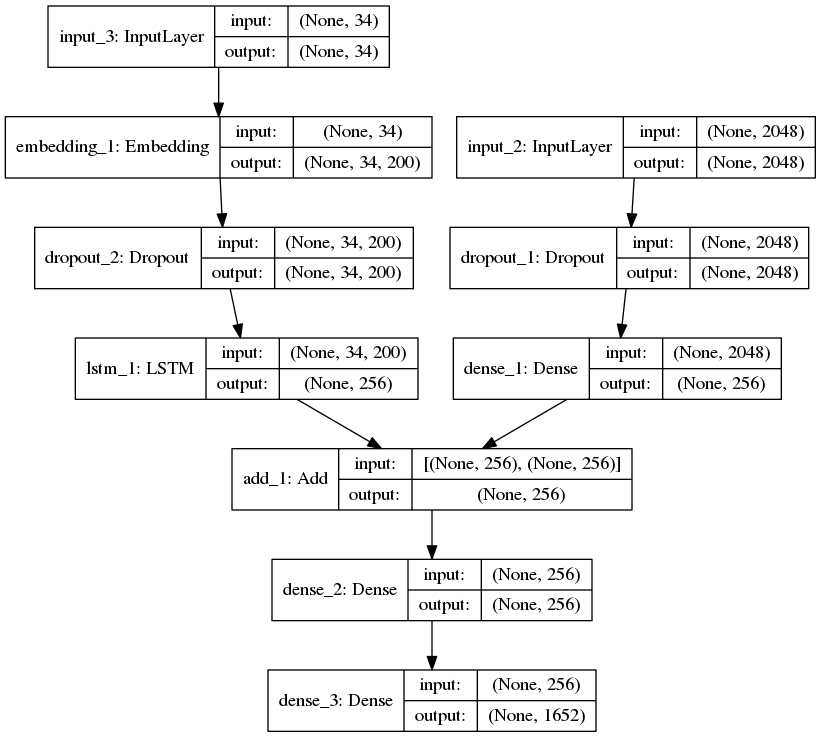

# Model

Inception and Xception model, importd using Keras, after the preprocessing of images
have been trained on the dataset.

The details about the Model can be found in the [Jupyter Notebooks](../Notebook).

Xception Model Design:

Inception Model Design:

A link to the Models can be found
[here](https://drive.google.com/drive/folders/15p-DIFNw5N71gxmGNz84JuXuKpKZ4pN7?usp=sharing)
