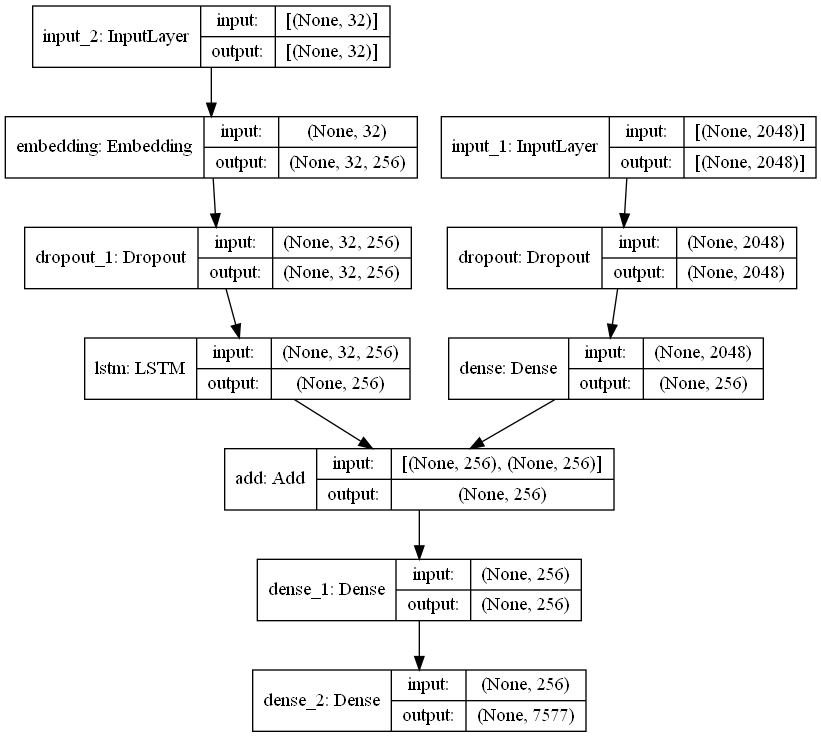

# Model

I have prepared 10 Xception Models & 10 Inception Models.

The details about the Model can be found in the Jupyter Notebooks.

Xception Model Design:

A link to the Xception Models can be found
[here](https://drive.google.com/drive/folders/15p-DIFNw5N71gxmGNz84JuXuKpKZ4pN7?usp=sharing)
